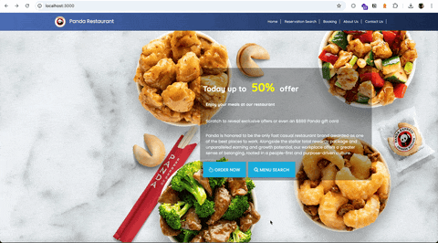

# Panda Restaurant Website



A modern, full-featured restaurant website built with Node.js and Express, featuring a responsive design and dynamic content management.

## Features

- Responsive design that works on desktop and mobile devices
- Dynamic content rendering with EJS templating
- Modern UI with animated components
- About us section with restaurant information
- CSS animations and transitions for enhanced user experience
- Error handling middleware
- Static file serving for images, CSS, and other assets

## Technologies Used

- Node.js
- Express.js
- EJS (Embedded JavaScript templating)
- CSS3 with animations
- Bootstrap
- Materialize CSS
- MySQL2 for database operations

## Prerequisites

- Node.js (v12 or higher)
- npm (Node Package Manager)
- MySQL Server

## Installation

1. Clone the repository:
```bash
git clone <repository-url>
cd pandarestaurant
```

2. Install dependencies:
```bash
npm install
```

1. Configure the database:
   - Open `utils/database.js` and update the MySQL connection details:
   ```javascript
   {
     host: 'localhost',
     user: 'your_username',
     password: 'your_password',
     database: 'pandaRestaurant'
   }
   ```
   Note: This file is gitignored for security

   - Run the database setup script:
   ```bash
   mysql -u your_username -p < seed.sql
   ```
   This will create the database and required tables for the application.

2. Start the development server:
```bash
npm run start
```

The application will be available at `http://localhost:3000`